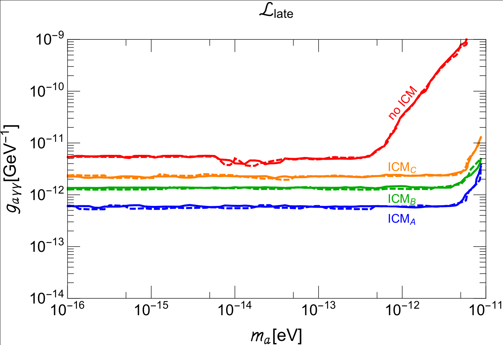

Last time we talked about two types of cosmic distance. Since I am a beyond the Standard Model (BSM) junkie -- so are lots of my collaborators -- the next question is naturally whether New Physics could affect this type of measurements. If yes, how much can the imprint guide us in BSM searches?

Cosmic distance measurement is the art of probing photons from far away sources. Heuristically, if we are going to modify the measurement result, we need to modify the amount of photons probed by the telescope. In addition, if we modify all measurements uniformly, it will be completely degenerate with the Standard Model predictions. In other words, you cannot distinguish between the source being faint or there is something modifying it if the amount of modification is constant for every source. Therefore, we are left with the only option of the modification varying at the cosmic scale. This hints for a very slow conversion of photons into something else that we do not detect, _i.e._ some dark sector that does not interact strongly with our detectors. In some sense, the hidden sector serves as a "sink" that the soup of photons "leak" into and disappear. 

Axions or axion-like particles (ALPs) are such candidates that can be light and interacting with photons feebly. A class of axions, the QCD axions, were originally proposed to solve the strong CP problem, while the broader class of ALPs arise in a lot of string theories as the pseudo Nambu-Goldstone-Bosons (pNGB), naturally light modes that do not require extra tuning.[^1] Let us see how it works.

The coupling between axions and photons is given by $$g_{a\gamma} a F_{\mu\nu} \tilde F^{\mu\nu} \sim g_{a\gamma} a \mathbf{E}\cdot \mathbf{B}$$, where $$a$$ is the axion field and $$F_{\mu\nu}$$ is the component of the electromagnetic tensor. When photons propagate through a magnetic field background, whose ubiquitous existence is hinted by evidence in galaxy clusters and intergalactic medium (IGM), conversion from photons to axions can happen with a probability roughly given by

\begin{align}
P_{a\rightarrow \gamma} \approx g_{a\gamma}^2 B^2 x^2,
\end{align}
where $$x$$ is the distance photons travel. The existing bounds on $$g_{a\gamma}$$ is roughly $$g_{a\gamma} \lesssim 10^{-11}\;\mathrm{GeV}^{-1}$$, and the upper bound on the magnetic field in IGM is below nano-Gauss. The more photons travel, the more they convert to axions, hence the dimmer the source looks like -- indeed, this modification of photon is distance dependent. This is something that is hard to mimic with the standard scenario. Simple estimate shows that we will have order one fraction of photon conversion when it travels between Mpc to Gpc distance, if we saturate the existing bound on $$g_{a\gamma}$$ and $$B$$. Of course, the magnetic field is not uniform at this scale, so caution should be taken in modeling the conversion, such as the adoption of cell magnetic field model as in a few studies.

In a [recent paper](https://arxiv.org/abs/2011.05993), my wonderful collaborators, JiJi and Manuel, and I worked out how axions modify both types of cosmic distance measurements discussed in the [last post](https://cosmicdiscord.net/2020-08-15-cosmic_distance/). Let us sketch the basic ideas.

### Axions' imprints in luminosity distance
After photons are emitted by the source, if we know how "many" of them are there we can infer the distance of the photon source, as discussed [here](https://cosmicdiscord.net/2020-08-15-cosmic_distance/). This gives us a map between the measured brightness magnitude and the distance of the object. Let's call this map the Standard Map. However, if photons are no longer conserved, we need to take into account the extra "leakage" due to the conversion to axions.

Luckily, the conversion probability increases roughly monotonically with the distance it travels, so we still have a well defined map between the brightness measurement and the distance of the objects, Type Ia supernovae (SNIa) in this case. The new map is different from the Standard Map. The stronger are photons coupled to axions, the faster the photon-to-axion conversion gets, hence the more the new map deviates from the Standard Map. On the other hand, there are independent inferences of SNIa's distance through the redshift measurement in spectroscopy. Given that we are not modifying the cosmology, a measured redshift has a well-defined meaning of cosmic distance in $$\Lambda$$CDM cosmology. You can see that if we modify the Standard Map too much with a non-vanishing axion-photon coupling, eventually, the inferred distance will be so absurd that it is not allowed by the one inferred from the redshift under $$\Lambda$$CDM. We take the coupling constant whose mismatch is barely allowed by the SNIa data set, Pantheon, and interpret it as the upper limit allowed by the data set.[^2] 

### Axions' imprints in angular diameter distance
You might think that angular diameter distance is nothing but a snapshot of an extended source object back when photons were emitted, and you are right thinking that way. As long as the "portrait" of the source is recognizable, it doesn't matter how bright it. In that sense, the measurement shouldn't care about some photons disappearing en route. The logic seems sound, however, this is only true in some cases. Remember from the [last post](https://cosmicdiscord.net/2020-08-15-cosmic_distance/) that to deduce the angular diameter distance, we need two ingredients: the knowledge of the physical size of the object, and the measured angle it subtends. While for some extended objects, such as Baryon Acoustic Oscillation (BAO), their physical size can be anchored and computed using other techniques (such as CMB or galaxy counting); some objects' physical sizes need to be inferred from measurements based on brightness variables. In the latter class, photon-axion conversion could affect the sources' size we perceive, which will subsequently propagate into the inferred angular diameter distance. Among a few examples, galaxy clusters are such objects whose physical sizes can be inferred from Sunyaev-Zeldovich effect, which is essentially the shift of CMB photon temperature when they pass through the clusters, and their X-ray surface brightness, which is due to electron Bremsstrahlung and line-emission. In the standard scenario, the bigger is the galaxy cluster, the stronger both effects are. In the case of photons couple to axions, the effect from the conversion can be mistakenly attributed to the galaxy cluster being bigger than it actually is. This leads to a mis-identification of the angular diameter size being big, in order to account for the fixed angular span from the observation. 

The rest is similar to the SNIa's methodology: a determination of the galaxy clusters' redshifts will tell us how far they are under $$\Lambda$$CDM cosmology. Too big a photon-axion coupling will eventually create a mismatch between the angular-size based distance determination and redshift-translated distance inference (under $$\Lambda$$CDM.) This in turn constrains the size of photon-axion coupling. We use the measurement done by Bonamente et al. and extract the corresponding upper bound on $$g_{a\gamma}$$. 

### Final thoughts
Some assumptions go into both methods, with the leading uncertainty coming from the modeling of the magnetic field in different environments. In SNIa method, the constrain is put on $$g_{a\gamma} B_{IGM}$$, while in the second method, it relies on the modeling of the magnetic field profile in Intra-Cluster Medium (ICM). We test the dependence on the assumptions with both Bayesian and Frequentist's approach. The final result can be summarized in the following plot.

{: .mx-auto.d-block :}

  In the plot ICM A-C are three different models of the magnetic field in galaxy clusters. We test all of them to show the uncertainty associated with the theoretical modeling. In the red curve we switch off photon-axion conversion inside galaxy clusters all together while allowing the conversion in IGM. This curve rescales as $$B_{IGM}$$/nG.

The idea of finding imprints of axion-photon conversion in cosmological measurements can be traced all the way back to work done in the early 2000s such as [this one](http://arxiv.org/abs/hep-ph/0111311) and [this follow-up](http://arxiv.org/abs/hep-ph/0204216). The difference to our new exercise is that Csaba et al. tried to use this photon disappearance channel to explain away cosmological constant (hence accelerated expansion) inferred from SNIa data set at that time. While the idea didn't work, given all the mounting evidence of a positive cosmological constant, we are happily surprised by that the data sets of cosmic distance measurements are precise enough to actually put considerable constraints on fundamental physics such as the axion-photon coupling. In addition to these photon sources, it remains an interesting direction to see if combining other cosmic distance that rely on brightness measurements could make the bounds stronger. Plus, it is a whole new play ground to see what other fundamental physics they can say about!
  
  

[^1]: Strong CP problem, naturalness problem, and spontaneous symmetry breaking are a few important concepts that have played driving role and have motivated a lot of BSM studies in high energy physics. There are plenty of discussions on them if you want to know more. I might dedicate a few posts on these topics in the future when I get the chance. 

[^2]: Some technical details are omitted here. In $$\Lambda $$CDM only the shape of the distance-redshift of SNIa is constrained. The normalization of the "standard candles" is not known a priori, so it needs to be either marginzalied over or anchored by other methods such as cepheids. 
