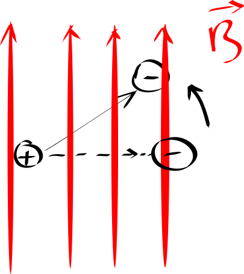
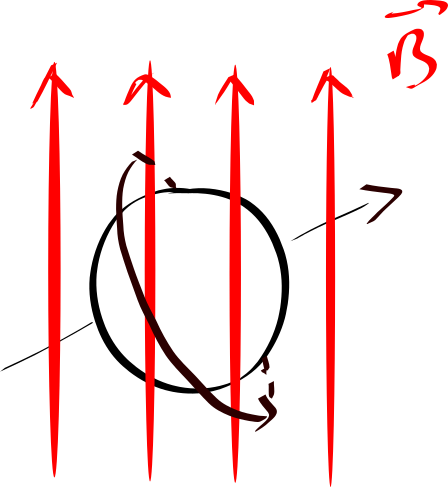

A few of my friends asked me about the recent [Fermilab results](https://news.fnal.gov/2021/04/first-results-from-fermilabs-muon-g-2-experiment-strengthen-evidence-of-new-physics/). We know that recently there is some "anomaly" going on at Fermilab, and the result is statistically significant when combined with the previous measurement from Brookhaven National Laboratory (BNL). This post will be mostly for the background. I will write another post about the QCD lattice prediction and clashes with the electroweak precision data. To understand what Fermilab and BNL have seen, we need to start with the magnetic dipole moment. 

### Magnetic (dipole) moment

Essentially, it describes how an object responds when an external magnetic field is applied to it. 

Any object's magnetic property, measured from far, can be approximated either by a small electric loop, or a small pair of opposite magnetic monopoles (direct analogy to electric dipole moment.) In the first approximation, the magnitude of the magnetic moment is the current times the area of the loop, pointing toward the thumb direction when you put the other four fingers of your right hand along the current direction; while in the second case, its magnitude is the length of the separation times the absolute value of the magnetic charge of either monopole, pointing from the positive charge to the negative charge. 

With both magnitude and direction, it can be described by a vector (technically pseudovector, but let's not go in there yet.) And the energy of the system is the lowest when this vector is aligned with the magnetic field. As a result, when the two are not aligned, there's a torque trying to rotate the magnetic dipole moment toward the magnetic field direction. Hence, the physics magnetic moment describes  the response of the system when a magnetic field is applied, as promised in the beginning. 

{: .mx-auto.d-block :}

### Spin

A lot of objects have nonvanishing magnetic moment, from as large as the Earth to as small as the hydrogen atom. Taking the hydrogen atom as an example, to an approximation, the magnetic moment is due to the electron rotating around the nucleus -- in this case just a single proton without any neutron. In the classical picture, it can be approximated by a small current loop due to the electron's motion around the proton. Surprisingly, even elementary particles -- those that cannot be subdivided, such as electron, or its heavier sibling muon -- have nonzero magnetic dipole moment. One might wonder how this is even possible, since, to the best of our knowledge, electrons do not have any "components", (hence one cannot find any moving parts rotating around the "electric center" - whatever that means.) Yet, quantum mechanically, the electron or muon, just as any other fermions, has a property called spin. This is a measured intrinsic property that shows up just like it is rotating with a fixed (quantized) magnitudes. Due to this property, it responds to external magnetic fields very similar to something that has a charged component rotating toward the center, like hydrogen.

{: .mx-auto.d-block :}

As physicists like to say, to the zero-th order, by looking at the response of fermions in the magnetic field, important properties of the interaction between magnetic field (photons) and the current loop (electrons or muons) can be deduced. This could shed light on unknown interactions at the most fundamental level. The effect is a quantum effect, and I will provide another sketch on how this is revealed through an unprecedented precision measurement of the (muon) magnetic moment. Stay tuned folks. 