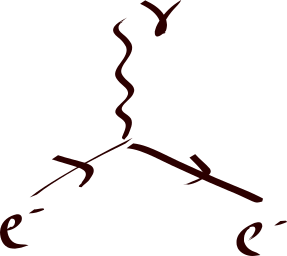
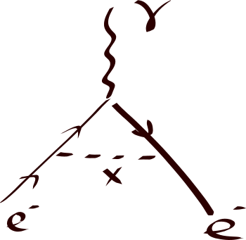

Now let's continue to understand the recent g-2 result.

### Classical value
Just like the classical current loop, or the classical approximation of hydrogen, the magnetic dipole moment is associated to how fast it rotates. In quantum mechanics, the value is fixed by the electron property, spin, being 1/2. The ratio between the magnetic moment and the spin, in the unit of "half-of-charge-mass-ratio" is two.

{: .mx-auto.d-block :}

### QED computation
However, as is understood now, "on-shell" particles -- particles that are stable and can have long lifetime -- are not the only building blocks in our universe. In a theory developed spanning from the 20s to 50s called quantum field theory (QED to be specific,) it is proposed that virtual particles, particle states that have very short lifetime and whose "mass" could be very different from their on-shell counterparts, can momentarily appear out of vacuum and quickly disappear due to the Heisenberg principle. This revolutionized the way people perceive how fundamental particles interact with each other. However, the theory suffers great problem in making predictions due to a problem related to what is now known as renormalization. Without properly subtracting certain terms and compare with experimental boundary values, the theory suffers infinities here and there, rendering it useless. This is so until around 1950s when Freeman Dyson, Richard Feynman, Julian Schwinger, and Shinichiro Tomonaga developed the modern version of the renormalization procedure. Electron g-2 was the first big test, as the term was predicted by (renormalized) QED and was ready to be compared with the experimental results. This was done in 1948 by Schwinger, and it was tested to be consistent with the experiment up to five digits, which was a miracle!

{: .mx-auto.d-block :}

### Higher order corrections
Since electromagnetic fields are all described by photons, the correction computed in the 40s first by Schwinger can be pictorially described as follows, using a type of diagram called Feynman diagram. When an electron responds to the magnetic field, it is actually scatters with one of the photons that the magnetic field is "made of". However, right before the electron scatters with the photon of the magnetic field, let's call it photon A, it can emit another photon (photon B) making both photon B and the electron itself "off-shell". After the off-shell electron scatters with the photon A, and it can re-absorb the photon it emitted earlier (photon B) and make itself on-shell again. With the later discovery of other fundamental interactions, weak and strong interactions, photon B can then emit other virtual particles before it gets absorbed by the electron. These effects are of higher order (meaning hierarchically smaller) of course. This makes measuring the electron magnetic dipole moment a great indirect way to check what new interactions or particles are there that could potentially couple to electrons and photons. The advantage of this approach is that the new particle could be heavy and hard to produce in collider experiments, yet we can measure their effect without actually produce them on-shell. 

### New physics contribution
There have been a lot of models trying to explain the tension in the last decade. The rough idea is that those virtual particles should not only include the Standard Model (SM) particles that talk to electrons and muons, they should also include those particles beyond SM, if they couple to electrons/muons as well.

{: .mx-auto.d-block :}

A class of them -- the axion models -- look particularly appealing due to theoretical reasons. They do not lead to the so-called naturalness problem by themselves. When we study the axion effective field theory (EFT) at low energy effective, there is parameter space showing they can address the muon g-2 anomaly without violating any other constraints. This makes a more careful study of the complete theory that generates the EFT very appealing, so we gave it a go. However, during the study of the UV complete theories, issues start to show up when one tries to complete the model. In our [recent paper](https://arxiv.org/abs/2104.03267), we point out that these models are very hard to build without violating the existing experiments. In other words, if these models are the answer to the missing piece that caused the mismatch between the experiment and theoretical prediction, they should come with other particles light enough that have already been observed at other collider experiments. 
I'll write more on this in a future post. 