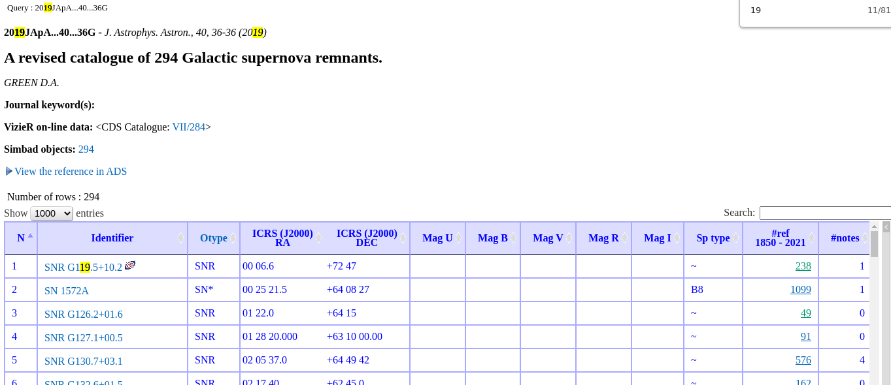
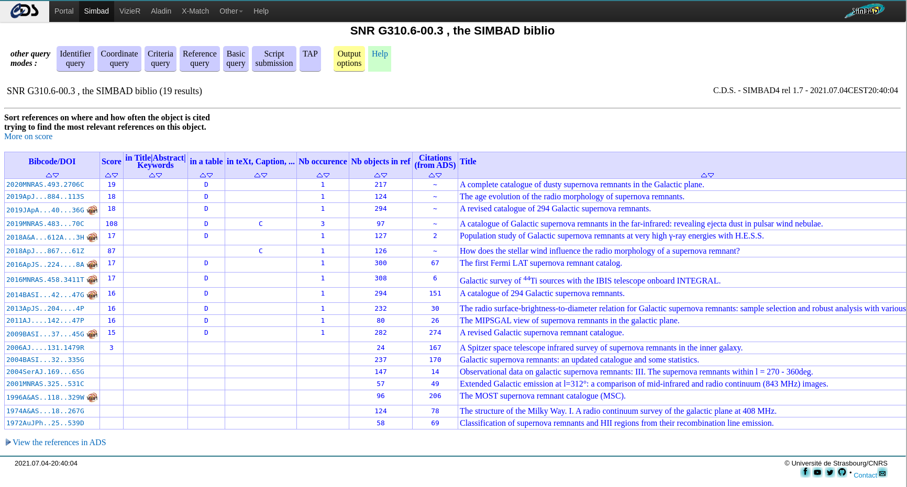
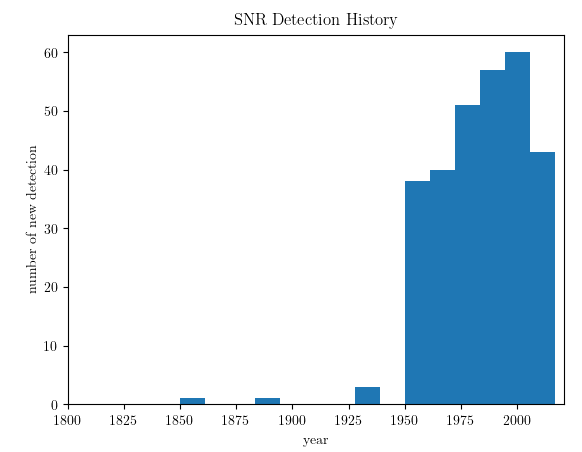
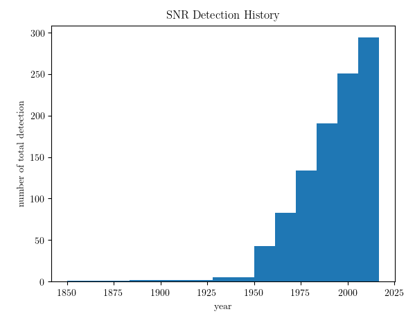

Dealing with astronomy data means I often need to deal with information collecting. Most of the time the API from the websites is powerful enough, I don't need to make any extra effort to clean the data. Once in a while, I am not happy with learning all the grammar of the API so I decide to act like a barbarian and do it the hard way: scraping the web page and play with the regular expression (regex for short.) Alright, after a brain racking day with all the discussions, let's have some different kind of fun -- ice-cold bear on, let's rock. 

In astronomy, most of the websites are friendly enough toward casual scrapers. Besides, since the data is mostly well structured/ formatted already, effort for cleaning the data is somewhere from non-existing to minimal. Plus, scraping is something once you are used to, it's hard to get over with. 

Let me show one quick example of web page scraping. The task is the following: I need to find out the discovery date of those 294 supernova remnant (SNR) from [this article](http://arxiv.org/abs/1907.02638). The task can be decomposed into a few steps: 

1. check if it's documented in this paper (duh..)
2. if not -- indeed -- find an online database that contains all the information
3. check the database and find the discovery date
4. automate

I'm sure you can guess 1) is negative. Fortunately, the data is all stored in Simbad at [this page](http://simbad.u-strasbg.fr/simbad/sim-ref?bibcode=2019JApA...40...36G&simbo=on).

{: .mx-auto.d-block :}

In principle, we can just export the data and call it a day. That said, I am not an expert of Simbad query grammar -- even though it seems very powerful -- nor am I in the mood of learning pages after pages of instructions. Plus, the discovery year is not explicitly documented in this table either. 
As a firm believer of minimal effort -- let's strategize. Immediately, it's clear that the year of each supernova can be achieved by clicking on the column "#ref" to show the papers that cited this SNR. Taking SNR G310.6-00.3 as an example, it has 19 citations and click on the number leads to [this page](http://simbad.u-strasbg.fr/simbad/sim-id-refs?Ident=SNR%20G310.6-00.3&Name=SNR%20G310.6-00.3).

{: .mx-auto.d-block :}

Without any doubt, the first entry is the discovery paper. All we need to do is follow the link of each SNR, and find the earliest discovery paper. No sweat!

The tool we are going to use is called <tt>scrapy</tt>. It's a versatile scraper engine. All you need to do is to specify what website you want it to scrape, and what links you want it to follow. Plus it speaks <tt>python</tt> so seriously how can one not love it. You can find fantastic tutorial [here](https://docs.scrapy.org/en/latest/intro/tutorial.html#intro-tutorial). Given that the use-case is slightly different, I'm going to include step by step instructions here anyway. 

First you create a crawler engine <tt>'greencat'</tt> by

	scrapy startproject greencat

Then you write your spider script at <tt>'greencat/spiders/'</tt>, and I'm going to call it <tt>discovery_year.py</tt>.
The debugging part takes up the main effort. This can be done with

```bash
scrapy shell "http://simbad.u-strasbg.fr/simbad/sim-ref?bibcode=2019JApA...40...36G&simbo=on"
scrapy shell "http://simbad.u-strasbg.fr/simbad/sim-id-refs?Ident=SNR%20G304.6%2b00.1&Name=SNR%20G304.6%2b00.1"
```
where the first line is for the starting page, and second one is for the page of a given SNR. Another useful tool is the _devoloper's tool_ in the Chrome browser. This allows you to highlight css blocks. Once you spot the right block that contains your data, you can try in the scrapy shell something like

```python
response.css('div table tbody tr')
```
which uses css selector -- instead of XPath, the native selector used by scrapy -- to select the block **div** that contains **table** that contains **tbody** (table body) that contains **tr** (table row).  For more on selectors see [here](https://docs.scrapy.org/en/latest/topics/selectors.html#topics-selectors). Afterward, we read the data row by row, and choose the right column that contains the citation number. In the end, the spider looks like the following:

```python
import scrapy
import re


class DiscYearSpider(scrapy.Spider):
    name = "disc_year" 

    def start_requests(self):
	urls = [
	    'http://simbad.u-strasbg.fr/simbad/sim-ref?bibcode=2019JApA...40...36G&simbo=on',
	]
	for url in urls:
	    yield scrapy.Request(url=url, callback=self.parse)

    # debug scrapy shell 'http://simbad.u-strasbg.fr/simbad/sim-ref?bibcode=2019JApA...40...36G&simbo=on'

    def parse(self, response):
	links = []
	table = response.css("div")[6] # get the table
	rows = table.css('table tbody tr')
	for row in rows:
	    target_block = row.css('td')[-2] # the one that contains the number of citations
	    number_of_citations = target_block.css('a::text').get() # get the number
	    link = target_block.css('a::attr(href)').get() # get the hyperlink
	    link = "http:"+link
	    links.append(link)
	    # follow link
	    # if links is not None:
	if len(links) > 0:
	    yield from response.follow_all(links, callback=self.parse_cite_page)

    def parse_cite_page(self, response):
	m = re.search('Name=(.*)', response._url)        
	name = m.group(1)
	rows = response.css('div table tbody tr')
	year_min = 9999
	for row in rows:
	    target = row.css('td')[0]
	    doi = target.css('a::text').get()
	    year = int(doi[0:4])
	    if year < year_min:
		year_min = year
	print('%s was discoverred at %d' %(name, year))
	yield {name: year}
```

Run it with:

```
scrapy crawl disc_year -O discovery_year.json
```

This generates <tt>discovery_year.json</tt> that looks like

```
[
{"NAME%20Kes%2020A": 1972},
{"SNR%20G310.6-01.6": 2010},
{"SNR%20G310.6-00.3": 1972},
{"SNR%20G309.8%2b00.0": 1974},
{"SNR%20G311.5-00.3": 1974},
{"SNR%20G309.2-00.6": 1960},
{"SNR%20G308.3-01.4": 1996},
{"SNR%20G308.1-00.7": 1996},
{"SNR%20G306.3-00.9": 2011},
{"SNR%20G308.8-00.1": 1992},
{"SNR%20G301.4-01.0": 1996},
{"SNR%20G299.6-00.5": 1996},
{"SNR%20G302.3%2b00.7": 1974},
{"SNR%20G312.4-00.4": 1977},
{"SNR%20G113.0%2b00.2": 2005},
{"SNR%20G304.6%2b00.1": 1968},
{"SNR%20G116.5%2b01.1": 1979},
...
```

The beer is gone, and I should call it a day as well. As a bonus, this is the detection rate of SNR over the last few decades:

{: .mx-auto.d-block :}

and the total SNR as a function of time:

{: .mx-auto.d-block :}

 (Cover image credit: NASA/CXC/MIT/UMass Amherst/M.D.Stage et al.)