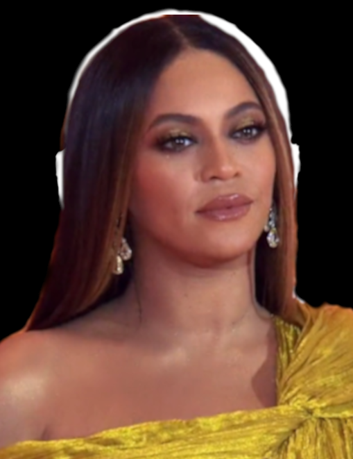
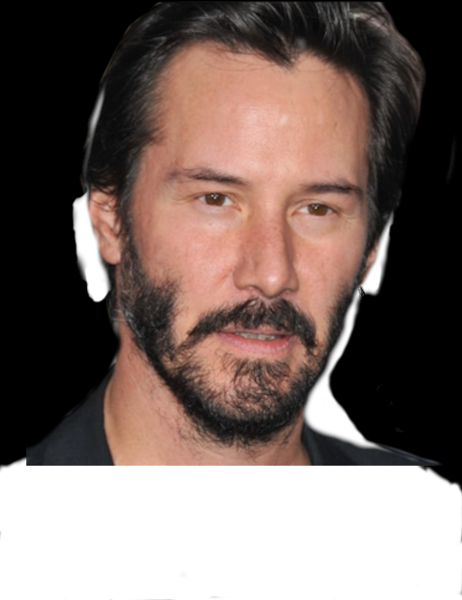
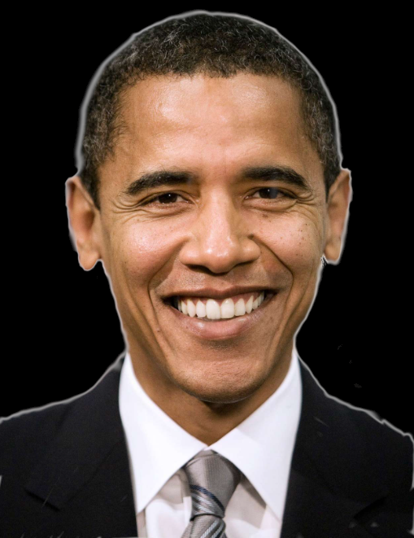
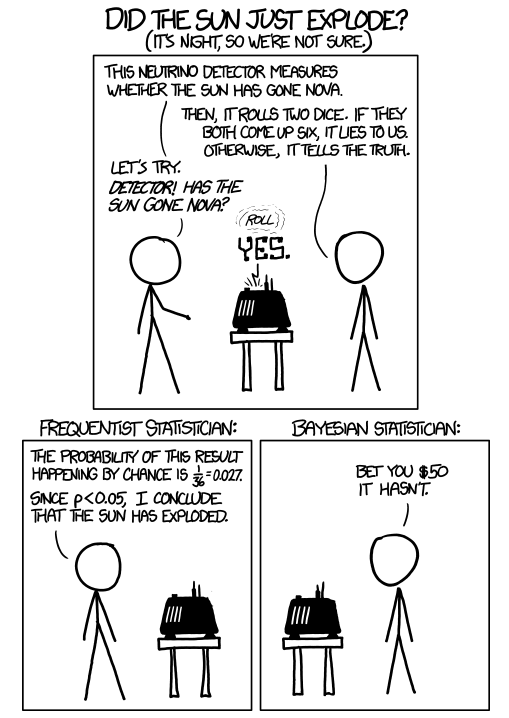

Have you ever wondered how a physicist gets convinced by a result? I sure did even before I entered physics. I'm also sure you have heard a lot of statements like "we will change our mind if we see enough evidence." So what's enough and how much is too much? That can actually be quantified quite easily. Aside from all the numbers you can easily find online (95% confidence level, 5$$\sigma$$ discovery, etc.) let me go over the qualitative aspect of how we theorists get convinced by experimental evidence. While waiting for the lamb stew on the stove, let me try and see if I can clarify a thing or two.

# Table of Contents

1.  [The good](#orgcc164d0)
    1.  [How physicists understand the world](#orgbf155a5)
    2.  [Correlations](#orgb419245)
2.  [The bad](#orge28be92)
    1.  [We as smart MCMC samplers](#org27fbd00)
    2.  [The prior matters](#orge2e7a37)
3.  [The ugly](#org8fbd470)
    1.  ["Overtraining"](#orgd438053)
    2.  ["Look elsewhere"](#org049c080)
4.  [Final thoughts &#x2013; treating unknowns](#org7908d05)

# The good

## How physicists understand the world

Sitting in my living room, I can see it's raining outside through the Spanish colonial-style glass window, so let's first think of the following statement we hear dozens of times, if not hundreds, from a weather person <a id="fnr.1" class="footref" href="#fn.1" role="doc-backlink">1</a>

> The chance of rain tomorrow is 90%. 

When it comes to chances, it can be easily interpreted in terms of the average number of events (the "mean", the "expectation value", or the "first (raw) moment", in technical terms,) should you choose to repeat the situation multiple times. This is certainly true for something repeatable, say a coin toss. If you repeatedly toss a coin many many times, you end up roughly half heads half tails.<a id="fnr.2" class="footref" href="#fn.2" role="doc-backlink">2</a>

However, you can't repeat tomorrow 1000 times. Therefore, the proper way of interpreting what the weather person says is that the chance of rain (in 24 hours) given similar weather conditions (as of now) is 90%. In other words, the chance indicates the credibility of the theory ("it is going to rain tomorrow.") So how do we go from inferring the outcome based on a theory (as in the coin toss) to inferring the underlying theory given some data? It involves something called Bayes' theorem.

If we take the probability of a statement (denoted A) being true as $$P(A)$$, and another statement (denoted B) being true when statement A is true as $$P(B\vert A)$$, Bayes' theorem says 

\begin{align}
 P(A\|B) P(B) = P(B\|A) P(A).
\end{align}

Both ends can be viewed as the probability of both A and B are true. 

Now let us treat A as the measurement. Naturally, a measurement can fluctuate due to random equipment noise (e.g. unwanted vibrations at [LIGO](https://en.wikipedia.org/wiki/LIGO) or radio noise at [SKA](https://www.skatelescope.org/wp-content/uploads/2014/03/SKA-TEL-SKO-0000308_SKA1_System_Baseline_v2_DescriptionRev01-part-1-signed.pdf) quantified by the antenna temperature) and fundamental quantum fluctuations (e.g. number of particles that have decayed at any moment.) Let us treat B as the underlying theory. Therefore the four quantities have their own meanings

-   P(data), the probability of a certain measurement generating "data". Once you make a measurement, we no longer care about it as it has already happened.
-   P(theory), the probability (or credibility of) the "theory" being true. This describes our prior knowledge of what kind of theories are true without relying on the specific measurement labeled "data". This prior knowledge could be derived from self-consistency of "theory" or inferred from other data sets that are outside our data set labeled as "data" here. This is usually referred to as *prior probability*. More about this later.
-   P(data $$\vert$$ theory), given the underlying theory of Nature being "theory", the probability of generating "data", also called the *likelihood*. As it's indicated by its name, it describes how *likely* a theory is the one under the hood that is responsible for generating the observed "data".
-   P(theory $$\vert$$ data), given the measurement "data", it describes how much I should trust "theory" being the right theory. It is often referred to as the *posterior probability*.

So when a physicist says they need evidence to support or confront their model, they are not that different from kids making a wish for a present on Christmas Eve &#x2013; they
simply express their wish of learning the posterior P(theory $$\vert$$ data), which can be expressed as

\begin{align}
P(\rm theory \vert data)
& = \frac{P(\rm data \vert theory ) P(\rm theory)}{P(\rm data)}
\end{align}

Since all we care about is how likely one theory is compared to another and the denominator is the same for all theories, we can focus on the numerator as

\begin{align}
P(\rm theory \vert data)
& \propto P(\rm data \vert theory ) P(\rm theory).
\end{align}

In addition, the bigger is "data" the better precision one can pinpoint the underlying theory. This can be understood in the following example. 
Suppose you know nothing about a coin tossing, you might want to derive the underlying theory. The theory you test is
> Theory: the chance you end up with heads is the same as it ends up with tails.

You make 4 tosses, and even if the theory you test is true, there is a significant chance of ending up with all four are heads or tails (each about 6% chance,) or heads to tails 3:1 (25% chance,) leaving 2 heads-2 tails only with a chance of about 37%. In this case, even if you end up with heads-to-tail 3:1, you can't falsify the theory above as you don't have a high enough confidence level. In this case, we say there is not enough data to support or falsify the theory "there is an equal chance of head and tail."

However, if you toss it 100 times, in the situation that the above theory that you test is true, the chance of having heads-to-tails 3:1 is about two parts out of 10 million. We see that the likelihood is very low. If you do end up with ~750 heads and ~250 tails, it should come as such a shock that encourages you to further investigate the coin you use, the coin toss experiment, or eventually the underlying theory.

As such, physics fundamentally depends on data. As such, we theorists heavily rely on our experimental friends and colleagues to make the measurements, take the data, and analyze it to a point that we can do the model building or crush our models.

One comment that's slightly tangential but important enough to digress &#x2013; building models and ruling out models themselves doesn't mean much unless it reveals some insights into how Nature works. To paraphrase my colleague Anson Hook's comment during a conversation not long ago: you can spend your whole life measuring the mass of each electron and claim it reveals fundamental New Physics if you find one that weighs differently from the rest, but there is a great chance you end up nothing. Simply falsifying a theory because it is falsifiable &#x2013; especially when there is no hint of something interesting happening here either from a theorist's point of view or an experimentalist's &#x2013; doesn't necessarily mean it contributes to the understanding of Nature. 

## Correlations

The above is for uncorrelated measurements, so what about the correlated events? We often want to infer one quantity (say the Higgs mass) but can only measure another observable (say counting the charged particle final states or the number of jets from quark hadronization.) As a result, we must infer the former quantity by taking into account the correlation with the latter observable.

The correlation between random variables being imperfect (meaning not two events are not 100% correlated) is something that is easily missed during our everyday life estimate, according to Daniel Kahneman, an Israeli-American psychologist and economist awarded the 2002 Nobel Memorial Prize in Economic Sciences. This will be worth a separate post on its own so I'm postponing expanding too much. 

Let me finish this part with a bad joke that I heard from my advisor.
>A surgeon tells her patient with confidence that he will survive. That's because although this kind of surgery has a high failure rate of five out of six, she had already failed five patients before him. Therefore, as the sixth patient, he will definitely live.

It's an example of how one can misinterpret statistics, of course, but should you care about the number of surgery failures that have already happened by your surgeon? In the eye of a Bayesian statistician, you should. Even though the failure rate is high, failing five patients in a row only has a chance of 40%. The surgeon has a track record much worse than the national average. This prior knowledge should be important enough to drive your posterior away from the "baseline" distribution, which you would default to should you know nothing about the surgeon's track record. As a result, you should be reasonably scared away to find another surgeon. After all, that the previous patients were killed by the surgeon has a strong correlation with your operation failure. 

# The bad

## We as smart MCMC samplers

The minds of us, humans, have well-defined "direction of thinking," and it's hard to inverse it. This manifests in finding the correct theory describing Nature from the observations, as much as detectives solving cases from traces of evidence. 
For example, if all we have is the following silhouette, it's hard to determine who it is.

What we could do is propose a theory, such as "this is Beyoncé" or "this is Keanu Reeves," and compare it with the data.

Apparently, it fits the data very poorly.

We could keep trying thousands of theories and finally find, ah-ha

On the other hand, if I give you this one first, then show you the first picture, it's hard not to un-recognize it. In reality, we are facing a lot of problems that only have a little bit of evidence so it's hard to "see through," while after reaching the right theory, things are obvious in the 20-20 hindsight.

Statistics enhances our reach to the truth given the limited amount of data. Say I have a few data points with their estimated error size regarding the measurement. How do I use it to distinguish models? We compare the model prediction with the data points and see how "likely" the data is a realization of a specific model. If it is unlikely, we try another model and compare again with the data.
 Slow, right? That's how it works since it's hard to see through the data in the opposite direction.
The bonus is, though, after dealing with enough models, you could get slightly better at noticing which direction of the model the data is pushing so the next time you build a model it's more likely to have the features the data implies.

For the same reason, oftentimes physicists do not prove something is wrong, but to show how likely (or rather how unlikely) a model is given the data evidence. That's right, we are like the lawyers to make a story and convince the jury/ the judge/ the world it is the true story. If you manage to get a story that is even more appealing (read: a model that fits the data even better) you might be able to get closer to the truth. 

However, this also introduces some extra layer of subtlety.

## The prior matters

In the previous example of fitting pictures to silhouette, suppose I told you that the picture was a politician, you would end up with the right "theory" much faster. This is more or less what the prior knowledge does in a physics analysis. 

A prior is not the same as a guess. It should be carefully derived somewhere, say with extra independent data sets or theoretical deductions. It can easily lead you astray when the prior is wrong. Suppose for some reason you think the silhouette from a rock star (well, Barack Obama is close to that, I have to admit,) you would never reach the truth until you abandon that wrong prior. 

# The ugly

## "Overtraining"

If you followed the basics of machine learning these years, you likely know the term over-training. It refers to the phenomenon that the neural network picks up a "feature" in the data that is not important, yet mistakenly attributes it to be the reason behind another phenomenon and uses it to make predictions. In other words, the network correlates the events that have no causal relations. 

A simple example is in order. There are massive studies of AI-powered facial recognition these years. Once [someone hacked the security cameras](https://www.newyorker.com/magazine/2020/03/16/dressing-for-the-surveillance-age) and turned "invisible" by wearing a T-shirt that has a traffic light pattern on it. The reason that it works is amusingly simple: because in the training data fed to the network, none of them has a face above the traffic lights, therefore the network mistakenly takes the fundamental reason for a face to be a face is that it appears below a traffic light. See? Attributing a fake feature due to the limited data points to something of fundamental significance.

In a way, superstitious beliefs are like over-training: in Chinese customs, it is often believed that playing with the broom or hitting someone with it leads to bad luck (e.g. see one of the examples [here](http://us.mofcom.gov.cn/article/aboutchina/202011/20201103012645.shtml#:~:text=Other%20customs%20and%20superstitions%20include,and%201pm%20quarrels%20will%20ensue.).) I tend to believe that the bad luck refers to the physical hazards (e.g. bodily injury) and biological hazards (mold, dust, airborne allergens) but in the old days there was no way to tell. 

Therefore, we should always use some caution when cooking up a model to explain a phenomenon or an anomaly. Is the feature in the data something due to a fundamental principle, or is it due to statistical fluctuations/ unknown systematics?

There is always the danger of one mistakenly linking the non-features (be it due to statistical noise, background, foreground, etc.) to a fundamental principle. We are aware of it and trying our best to avoid it. A couple of things we try to get rid of this bias include

-   generate more statistics, which means longer running time of the experiment, longer observation time, higher resolution, etc.
-   better understanding of the background, which involves trying to interpret the data with conservative models using known physics only without breathtaking New Physics. Perhaps boring to many people but quite necessary before jumping to exciting New Physics.

## "Look elsewhere"

When the chance for something to happen is merely 1%, yet you try 100 times, the chance for it  not to happen in any trials is only $$0.99^{100} \approx 37\%$$. In other words, it's more likely for it to happen at least once (~63%) than it doesn't happen at all (37%.)

Experimentalists are well aware of this since many searches/analyses are going on at the same time. It would be surprising that none of the searches yield an anomaly. Therefore, the so-called look-elsewhere effect is taken into account during the anomaly searches. 

However, it is hard to quantify the number of failed attempts a theorist has before a model works. Aside from the prediction vs postdiction debate, this also obscures how natural a model really is in terms of addressing an anomaly in the data. Theorists subconsciously account for this by somehow adjusting the amount of attention to the so-called ambulance-chasing models unless it is really appealing. 

# Final thoughts &#x2013; treating unknowns

When we know that there are unknowns, we fit those unknowns with a flat prior. That means we do not put in any theoretical preference but let the data determine the quantity. 
For those parameters that we do not care about, denoted as nuisance parameters, we either fit them and fix them based on the best-fit point or average the posterior over a reasonable range (marginalization, in technical terms.)

Let's take the Type Ia Supernova as an example. While we know that they have similar intrinsic luminosities with small variations (Standard Candles,) we cannot compute their actual magnitude yet. As such, Type Ia supernovae are already powerful enough as long as we can anchor their luminosities using other observational methods (the distance ladder as I explained [here](../2020-08-15-cosmic_distance)). In practice, we do not put in any theory prior on their intrinsic luminosity but fit it as a nuisance parameter. 

Let me just end with a joke I like about the Bayesian vs Frequentist approach. It's from [xkcd](https://xkcd.com).

# Footnotes

<a id="fn.1" href="#fnr.1">1</a> This is the first example my advisor used to use to teach me Bayesian statistics.

<a id="fn.2" href="#fnr.2">2</a> Though in real world it is shown that due to the weight imbalance of the coin, the actual head-to-tail chance is closer to 51/49 biased toward whichever side is up according to this [paper](https://epubs.siam.org/doi/abs/10.1137/S0036144504446436?casa_token=u8ebMe4s_VgAAAAA:8VqtTIMwAdp50bQAMZk7WPnDIkcK3p7C7T9IbuEY_Sz4fg1F768Uc6ASqOrmF9wEm4SRCoRz). Spinning a coin seems to lead to even greater bias toward the heavier side as mentioned [here](https://www.smithsonianmag.com/science-nature/gamblers-take-note-the-odds-in-a-coin-flip-arent-quite-5050-145465423/).
