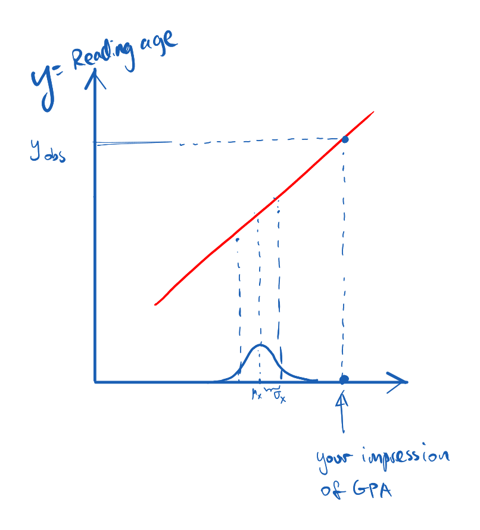
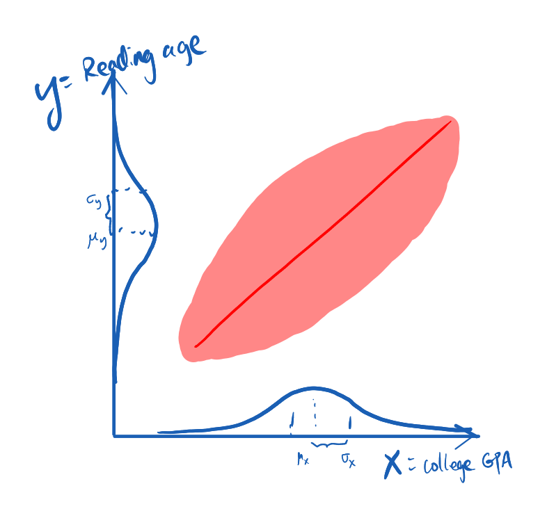
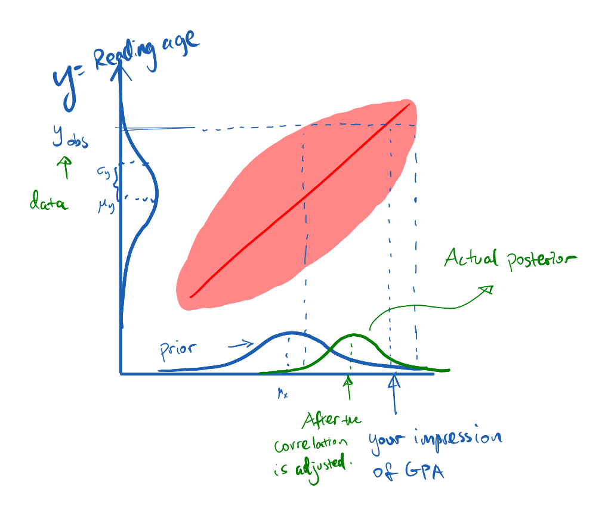

Ever since I received Daniel Kahneman's Thinking Fast and Slow as my birthday present, it is one of my new favorite non-physics non-fiction books. It has lots of interesting points about how the mind works. As a professional from a different field but employing lots of similar methods, I can relate to him how much it takes to simplify the narrative but not to over-simply it. I must say that Kahneman has done a decent job.

One of the things that I find hard to like is the lack of derivation and details of some conclusions. I'm sure it is trivially true in the eye of many experts in that field but not me. During the reading of the book, I can't help but raise some doubts about the experiment setups in some cases and the math in others. After all, friends and families sometimes find me a bit hard to convince and I find occasions in which I need to try hard to refrain from saying "show me on the board" or "I need more evidence."

One interesting point Kahneman raises is the concept of correlation in everyday life.  It is shown that it is hard for the human mind to "perceive" statistics &#x2013; one of the main points of the book &#x2013; so, Kahneman proposes to

1.  use slow thinking;
2.  apply regression when estimating something.

Slow thinking is a concept that refers to using effort (think of the process of getting 1283&times;233) rather than intuition, the fast thinking, (think of the process of figuring the answer to "what's the color of the sky?") Without spoiling too much of the book, let's jump to point 2 and go from therem. 

# Table of Contents

1.  [An example: predicting your future GPA](#org26b7c49)
2.  [Think of correlations, visually](#orgf7679dd)
3.  [Think of correlations, quantitatively](#org46833b0)

# An example: predicting your future GPA

Let's take from the book the example of estimating the future GPA of a kid given his/her reading age. When someone starts to read very earlier than average, it's causally related to academic talent. As a result, if the kid is in the top 10% of the early age to start reading (say starts to read at four,) it is likely for people to jump to the concussion that he/she will likely end up with a high GPA in college in the top 10% around 3.7 or 3.8 out of 4.

However, this is true only if the correlation between the two events is 100%. In reality, reading age and college GPA share some common factors (attention span, academic talent, adaptability to abstract symbols, etc.) but also have lots of their own determining factors (family support, peers, education during k-12, etc.)

Roughly speaking, correlation describes how likely one event is to happen together with another. For example, under normal pressure and mineral composition, the outdoor temperature drops below zero Celsius tomorrow (event A) and still water freezes tomorrow (event B) has a correlation of 1.
On the other hand, the outdoor temperature drops below zero Celsius tomorrow (event A) and I win a lottery jackpot (event B) has no relation hence a correlation of 0. 
Lastly, the outdoor temperature drops below zero Celsius tomorrow (event A) and it will snow tomorrow (event B) has a correlation between 0 and 1. 

The missing chain in the above example of estimating the college GPA is precisely the lack of taking correlation into account. Suppose the correlation is merely 30% between early reading age and college GPA, according to Kahneman, the correct procedure for predicting the future GPA should be

1.  Write down your impression of the future GPA of the kid based on the reading age (3.8 here,)
2.  Get the average GPA of all college students (3.1)
3.  Estimate the correlation between reading age and college GPA (let's denote it $$\rho$$ and give it $$\rho=30\%$$ at most, given all the different determining factors,)
4.  **adjust your estimate toward the average by the fraction of $$\rho$$.** ($$3.1 + (3.8-3.1) \rho \approx 3.3$$.)

As a result, after taking into account the imperfect correlation ($$\rho\approx 0.3$$ instead of $$\rho=1$$,) the final estimate is much closer to the mean value. The last step is the core of this adjustment and seems non-trivial to me. Let's understand it then. 

# Think of correlations, visually

The book refers to this as the baseline adjustment and stops short at this demonstration. 
If it's true, this is certainly an interesting procedure that can be used for a lot of everyday life estimates. As a sanity check, something physicists do every day, if the correlation $$\rho$$ is zero, the reading age shouldn't affect the college GPA at all so the expectation of *this kid* should be around just the overall average, $$3.1 + (3.8-3.1) \times 0 \approx 3.1$$. That makes sense. On the other hand, if the correlation is 100%, the result should be solely determined by the reading age, which means the first impression without thinking about the overall average should be the right answer: $$3.1 + (3.8-3.1) \times 1 \approx 3.8$$, which also checks out. 

It got me more intrigued and I started to wonder how accurate is this formula. Let's try to visualize the situation. Suppose we have two random variables, each has its own distribution but the two are strongly correlated (read: correlation being 1.) The correlation can be sketched as the following:

In the sketch above the red line is very thin to reflect that the correlation between X and Y is 100%. Knowing the reading age of a kid is like making a measurement on variable Y. After the measurement, for this specific kid, Y is no longer a random variable but a definite value. In practice, we can think of Y after the measurement as a distribution that is very narrow around the measured value (the Dirac delta function.) This is roughly shown in the following

Since X and Y are 100% correlated, measuring Y will necessarily determine X. This is the same as finding the temperature outdoor below zero Celsius immediately gives me the knowledge that the fish bowl I accidentally left outside should be freezing. In practice, it's reasonable to think of the reading age and the college GPA to have a loose correlation, if not zero at all, as in the following sketch

Now after we have measured variable Y (knowing the reading age) all we can say about X is still a distribution.

You can see that the mean of the posterior is not as much off-the-chart as your initial impression assuming a 100% correlation.

# Think of correlations, quantitatively

Now qualitatively, the reasoning seems to make sense. What about at the quantitative level? 
Let's go through a little bit of proper math then, something Kahneman lacks in the book.

First of all, suppose we have the probability density functions for two random variables, X and Y, denoted as $$P(X)$$ and $$P(Y)$$.
Let us define $$\mu_{X}$$ to be the expectation value of X, and $$\mu_Y$$ the expectation value of Y. Formally, this is given by

\begin{align}
\mu_X & = \left < X \right > \equiv \int P(X) X, 
\end{align}

where the bracket is the integral of the quantity inside the bracket  together with the probability density function. For example, $$\left < X^{3} \right >$$ is nothing but $$\int dX P(X) X^3$$. 
Next, let us denote $$\sigma_{X(Y)}$$ the variance of X (Y), respectively.

\begin{align}
\sigma_X^2 & = \left < (X - \mu_X)^2 \right > \equiv \int dX P(X) X^2 - \left (\int dX P(X) X \right )^2.
\end{align}

For two random variables, the mathematical definition of correlation is given by

\begin{align}
\rho_{X,Y}
& = \left < (X - \mu_X)(Y-\mu_Y) \right >/\sigma_X \sigma_Y,
\end{align}

With this in mind, let's check the expectation value of $$X$$ after $$Y$$ is measured.
First of all, by the definition of the correlation, the following relation holds

\begin{align}
\int P(X|Y) P(Y) XY - \mu_X \mu_Y = \rho_{XY} \left (\int P(X) (X^2- \left <X \right >^2) \int P(Y) (Y^2-\left <Y \right >^2) \right )^{1/2}.
\end{align}

The moment $$Y$$ is measured it's no longer a random variable, therefore, the distribution peaks at the measured value. Let us approximate $$P(Y)$$ with the [Dirac delta function](https://en.wikipedia.org/wiki/Dirac_delta_function), $$P(Y) = \delta(Y-Y_{\rm obs})$$. It is easy to see that $$\mu_Y = Y_{\rm obs}$$. As a result, the above relation becomes

\begin{align}
\left (\int P(X|Y_{\rm obs}) X \right ) - \mu_X = \frac{\rho_{XY} }{Y_{\rm obs} } \left (\int P(X) (X^2- \left <X \right >^2) \int P(Y) (Y^2-\left <Y \right >^2) \right )^{1/2}.
\end{align}

Finally, we see that

-   in general, there is a shift of expectation of $$X$$ after more data is provided (e.g. the age a kid starts to read in the case of determining the future college GPA, or more type Ia supernovae collected in the case of measuring the cosmic expansion history.)
-   After making the measurement of $$Y$$, the expectation value of $$X$$ (i.e. the posterior) should be shifted from the baseline (the prior) expectation value $$\mu_X$$. The more $$Y$$ deviates from $$\mu_Y$$, the more $$X$$ is shifted from $$\mu_X$$.
-   The amount of shift is also proportional to the correlation between $$X$$ and $$Y$$. In the extreme case of $$X$$ and $$Y$$ are totally uncorrelated, $$\rho_{XY}=0$$. Measuring $$Y$$ doesn't help with the determination of $$X$$ at all.
-   In the case of that if $$0< \rho_{XY} <1$$, as in most cases in physics searches and everyday decision makings, the amount of shift is smaller by a fraction of $$\rho_{XY}$$ compared to the case of a perfect correlation ($$\rho_{XY}=1$$, something we tend to jump to when an impression first forms, as shown in the example in the beginning. )

So we have verified the procedure from Kahneman's Thinking Fast and Slow in curbing the temptation of giving in to your first impression, as when the mind thinks fast, it tends to assume a perfect correlation between causally related things. Let me repeat the procedure as the takeaway:

1.  Write down your impression of the thing you want to predict (e.g. college GPA) after having extra data (e.g. age to start reading,)
2.  Get the average of the quantity pretending you don't know the extra information (average college GPA in the States)
3.  Estimate the correlation between the thing you want to estimate and the extra information (0 < &rho; < 1.)
4.  adjust your estimate toward the average by the fraction of $$\rho$$.

